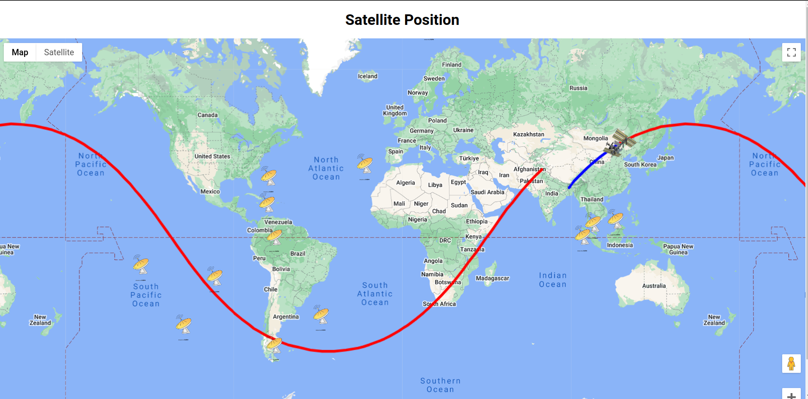
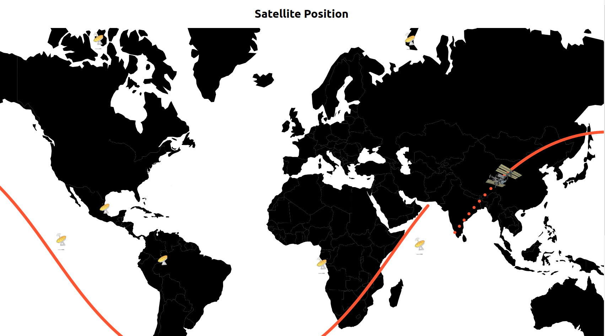

# SAT-TRACK

Sat-Track is a satellite ground-track visualization tool with additional provisions for adding groundstation/antenna plotting using their Latitudes and Longitudes.
Sat-track can be implemented using Google Maps, and incase you lack access to an API key, fret not, for there is an implementation using "react-simple-maps" as well.
**Sat-Track is currently using the TLE for the ISS and plots random coordinates for Ground-stations.**

## GOOGLE MAPS:
 

  

* Clone the GMAPS-API branch of this repository and run **npm install**.
* Replace **"process.env.REACT_APP_GOOGLE_API_KEY"** in satelliteMap.js with your acquired Google Maps API key.
* Replace the "ISS_TLE" in App.js with the TLE of the satellite you would like to track.
* Get rid of the random groundstations being generated in SatellitePoints.jsx and replace with latitudes and longitudes of groundstations that you would like to plot.
* Run **npm run start** and watch the project come to life.

## React-Simple-Maps:
 

  

* Clone the main branch of this repository and run **npm install**.
* Replace the "ISS_TLE" in App.js with the TLE of the satellite you would like to track.
* Get rid of the random groundstations being generated in SatellitePoints.jsx and replace with latitudes and longitudes of groundstations that you would like to plot.
* Run **npm run start** and watch the project come to life.
